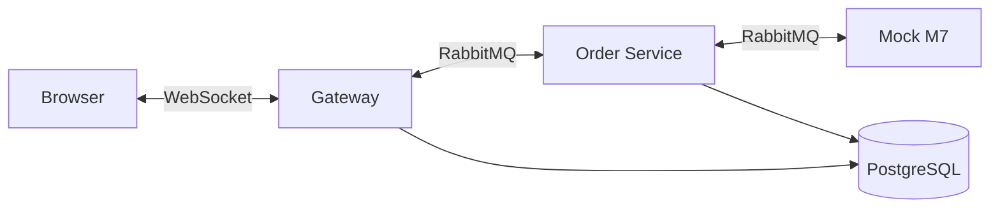
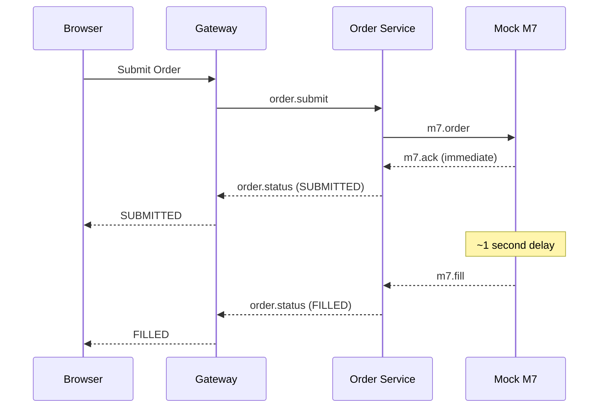

# Electricity Trading WebSocket

A practice project for implementing real-time WebSocket communication, built as a foundation for a larger electricity trading platform that connects to the **M7 EPEX SPOT market**.


## Background

Our main project is an electricity trading platform currently in **alpha phase**. Initially, we implemented polling to stream live market data to the frontend with plans to "defer WebSocket for later." We quickly realized this approach would accumulate significant technical debt—polling doesn't scale well for real-time trading where milliseconds matter.

This repository serves as a hands-on learning project to understand WebSocket/STOMP patterns before integrating them into the production trading platform. It evolved into a microservices architecture as an opportunity to learn RabbitMQ-based service communication.

## Tech Stack


## Architecture



| Service | Port | Description |
|---------|------|-------------|
| Gateway | 8080 | WebSocket, REST API, JWT Authentication |
| Order Service | 8081 | Order processing, state machine, persistence |
| Mock M7 | 8082 | Simulates EPEX SPOT trading engine, price generation |
| RabbitMQ | 5672 | Message broker (Management UI: 15672) |
| PostgreSQL | 5432 | Database (users, orders) |

**[Architecture Documentation](docs/ARCHITECTURE.md)** - Design patterns, message flows, and system design.

**[Decision Log](docs/DECISIONS.md)** - Architectural Decision Records (ADRs) explaining key technical choices.

## Features

- **Real-time Price Broadcasting** - Mock M7 generates prices, broadcast via WebSocket
- **WebSocket + STOMP** - Bi-directional messaging with topic subscriptions
- **Order Lifecycle** - Full state machine: PENDING → SUBMITTED → FILLED/REJECTED
- **Microservices** - Gateway, Order Service, Mock M7 communicate via RabbitMQ
- **JWT Authentication** - Secure WebSocket connections with token-based auth
- **Auto-reconnection** - Exponential backoff (1s, 2s, 4s...) with max 5 attempts
- **Idempotent Messaging** - Handles duplicate/out-of-order messages gracefully

## Quick Start

```bash
make up      # Start full Docker stack (all 5 services)
```

Open `http://localhost:8080` in your browser.

### Local Development
```bash
make deps         # Start PostgreSQL + RabbitMQ only
make run-gateway  # Run Gateway in terminal 1
make run-order    # Run Order Service in terminal 2
make run-m7       # Run Mock M7 in terminal 3
```

## Make Commands

| Command | Description |
|---------|-------------|
| `make up` | Start full Docker stack |
| `make down` | Stop all containers |
| `make deps` | Start only postgres + rabbitmq |
| `make rebuild` | Rebuild and restart app containers |
| `make run-gateway` | Run Gateway locally |
| `make run-order` | Run Order Service locally |
| `make run-m7` | Run Mock M7 locally |
| `make test` | Run unit tests |
| `make fmt` | Auto-format code |
| `make build` | Build all modules |
| `make logs` | Tail all service logs |
| `make health` | Check health of all services |

## API Endpoints

### REST
| Method | Endpoint | Description |
|--------|----------|-------------|
| POST | `/api/auth/login` | Authenticate and receive JWT |
| POST | `/api/auth/register` | Register new user |
| GET | `/api/orders` | Get user's order history |
| GET | `/api/orders/{orderId}` | Get specific order |
| DELETE | `/api/orders/{orderId}` | Cancel an order |

### WebSocket (STOMP)
| Destination | Direction | Description |
|-------------|-----------|-------------|
| `/topic/prices` | Server → Client | Subscribe for price updates |
| `/app/order` | Client → Server | Submit order |
| `/user/queue/order-confirmation` | Server → Client | Receive order confirmations |
| `/user/queue/errors` | Server → Client | Receive error messages |

## Order Lifecycle



**States:** `PENDING` -> `SUBMITTED` -> `FILLED` | `REJECTED`

## CI/CD

GitHub Actions runs on push/PR:
1. Code formatting (Spotless)
2. Unit tests
3. Build
4. Docker image (main branch)
