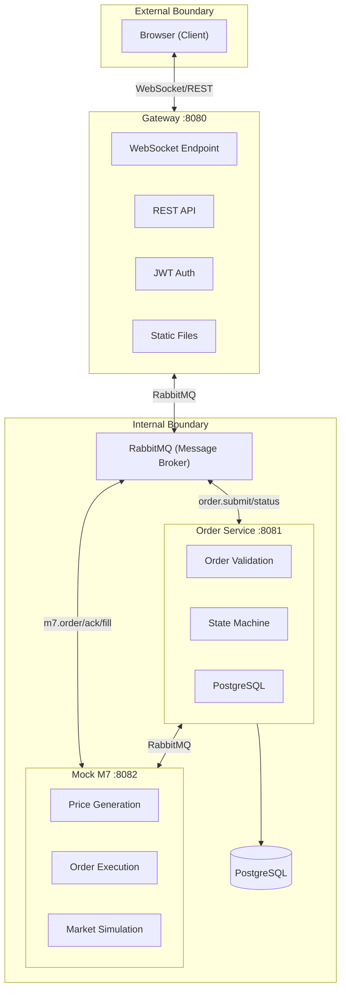
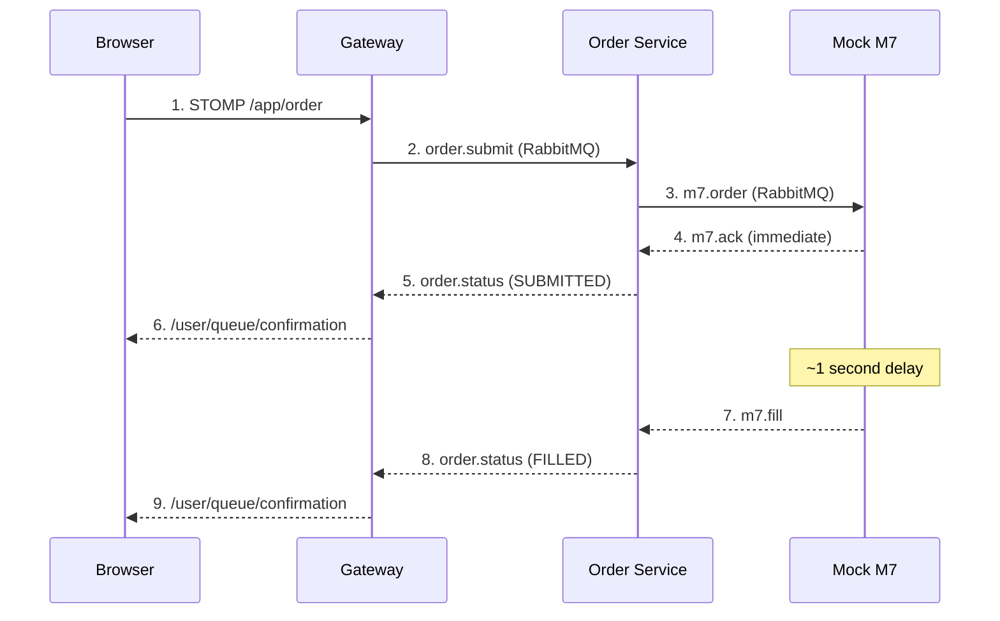
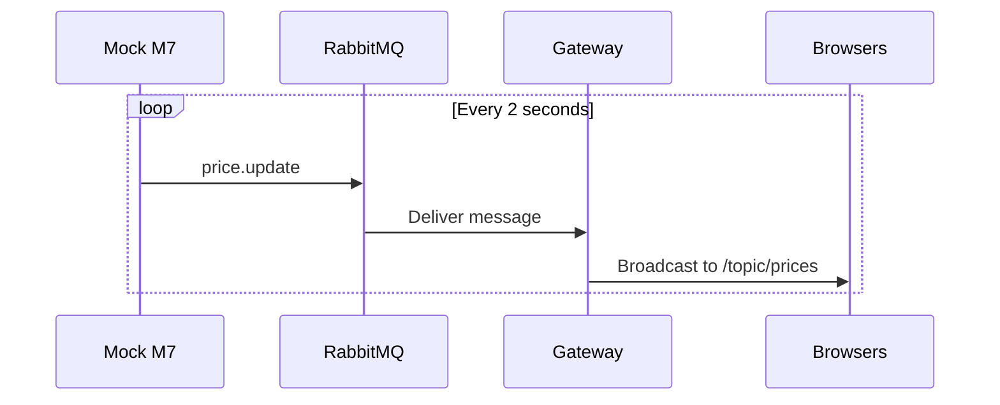
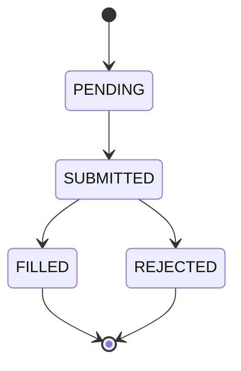
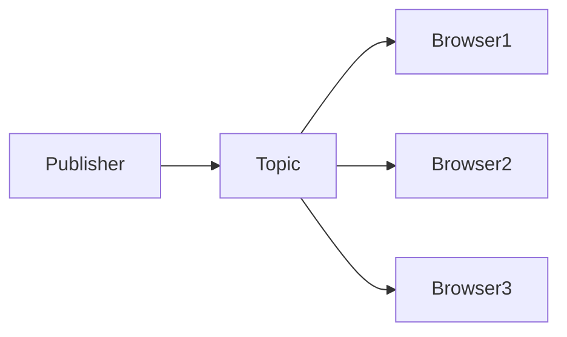
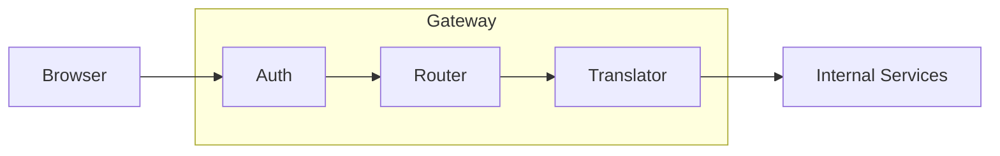
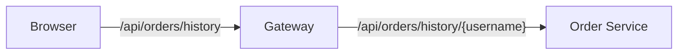
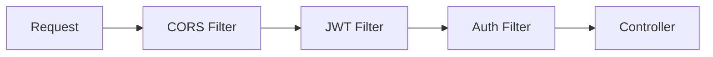

# Architecture Documentation

This document explains the architectural decisions, design patterns, and system design of this electricity trading platform.

## Table of Contents
- [Why Microservices?](#why-microservices)
- [Service Responsibilities](#service-responsibilities)
- [Message Flow](#message-flow)
- [Design Patterns](#design-patterns)
- [Technology Choices](#technology-choices)

---

## Why Microservices?

This project uses a microservices architecture instead of a monolith. Here's the reasoning:

### Benefits Demonstrated

| Benefit | How It's Demonstrated |
|---------|----------------------|
| **Independent Scaling** | Mock M7 (price generation) could scale separately from Order Service during high-volume trading |
| **Fault Isolation** | If Mock M7 crashes, Gateway still serves the frontend and Order Service retains order history |
| **Technology Freedom** | Each service could use different databases or languages (e.g., Mock M7 could be Python for ML-based pricing) |
| **Independent Deployment** | Update Order Service logic without redeploying Gateway or Mock M7 |
| **Team Ownership** | In production, different teams could own different services |

### Trade-offs Acknowledged

| Trade-off | Mitigation |
|-----------|------------|
| **Distributed Complexity** | RabbitMQ provides reliable async messaging with acknowledgments |
| **Network Latency** | Async messaging means users don't wait for cross-service calls |
| **Data Consistency** | Event-driven updates ensure eventual consistency |
| **Operational Overhead** | Docker Compose simplifies local development |

### When a Monolith Would Be Better

For a solo developer or small team with a simple domain, a monolith is often the right choice. This project uses microservices as a **learning exercise** to understand patterns used in production trading systems.

---

## Service Responsibilities



### Gateway Service (Port 8080)

The **API Gateway** is the single entry point for all client communication.

**Responsibilities:**
- WebSocket endpoint for real-time bidirectional communication
- REST API for authentication (login/register) and order history
- JWT token generation and validation
- Static file serving (HTML, CSS, JavaScript)
- Translates WebSocket messages to RabbitMQ messages and vice versa

**What it does NOT do:**
- Business logic (order validation, pricing)
- Direct database access for orders
- Order state management

### Order Service (Port 8081)

The **Order Service** owns all order-related business logic and data.

**Responsibilities:**
- Order validation (quantity, price, region)
- Order state machine (PENDING -> SUBMITTED -> FILLED/REJECTED)
- PostgreSQL persistence
- Communicates with Mock M7 for order execution

**Pattern:** This service follows **Database-per-Service** - it owns the orders table and no other service accesses it directly.

### Mock M7 (Port 8082)

Simulates the **EPEX SPOT M7 trading engine**.

**Responsibilities:**
- Generates realistic electricity prices (with random fluctuations)
- Simulates order execution (accepts/rejects orders)
- Broadcasts price updates via RabbitMQ

**In production:** This would be replaced with an actual connection to the M7 EPEX SPOT API.

---

## Message Flow

### Order Submission Flow



### Price Broadcasting Flow



### RabbitMQ Routing Keys

| Routing Key | Publisher | Consumer | Purpose |
|-------------|-----------|----------|---------|
| `order.submit` | Gateway | Order Service | New order submission |
| `order.status` | Order Service | Gateway | Order status updates |
| `m7.order` | Order Service | Mock M7 | Order execution request |
| `m7.ack` | Mock M7 | Order Service | Immediate acknowledgment |
| `m7.fill` | Mock M7 | Order Service | Execution result (fill/reject) |
| `price.update` | Mock M7 | Gateway | Price broadcasts |

---

## Design Patterns

### 1. State Machine Pattern

**Where:** Order lifecycle management in Order Service

**Problem:** Orders go through multiple states (PENDING -> SUBMITTED -> FILLED/REJECTED). Invalid transitions must be prevented.

**Solution:** Explicit state enum with validated transitions. The service rejects any attempt to transition to an invalid state (e.g., PENDING -> FILLED).



### 2. Observer Pattern (Publish-Subscribe)

**Where:** WebSocket price broadcasting, RabbitMQ messaging

**Problem:** Multiple clients need to receive price updates. The publisher shouldn't know about specific subscribers.

**Solution:** Topic-based pub/sub through STOMP and RabbitMQ. Clients subscribe to `/topic/prices` and automatically receive all broadcasts.



### 3. API Gateway Pattern

**Where:** Gateway Service

**Problem:** Clients need a single entry point. Internal services shouldn't be exposed directly.

**Solution:** Gateway acts as the single entry point, handling authentication, request routing, and protocol translation (WebSocket <-> RabbitMQ).



### 4. Message Queue Pattern (Async Messaging)

**Where:** RabbitMQ communication between services

**Problem:** Synchronous HTTP calls create tight coupling and fail when services are down.

**Solution:** Asynchronous messaging with RabbitMQ provides decoupling (sender doesn't wait), reliability (messages persist if receiver is down), and load leveling (queue absorbs traffic spikes).

### 5. DTO Pattern (Data Transfer Object)

**Where:** All inter-service communication

**Problem:** Internal domain objects shouldn't be exposed to external systems. Different layers need different data shapes.

**Solution:** Dedicated DTOs for each boundary. Internal entities have database annotations and all fields; external DTOs expose only what clients need, using Java records for immutability.

### 6. Proxy Pattern

**Where:** Gateway's Order History endpoint

**Problem:** Frontend needs order history, but Order Service is internal (not exposed to browsers).

**Solution:** Gateway acts as a proxy, forwarding authenticated requests to Order Service and returning responses to the client.



### 7. Filter Chain Pattern

**Where:** Spring Security JWT authentication

**Problem:** Multiple cross-cutting concerns (authentication, logging, CORS) need to process requests.

**Solution:** Chain of filters that each request passes through. JWT filter validates tokens before the request reaches controllers.



### 8. Repository Pattern

**Where:** Database access in Order Service

**Problem:** Business logic shouldn't contain SQL queries or know about database specifics.

**Solution:** Repository interface abstracts data access. Spring Data JPA implements the interface automatically from method names.

---

## Technology Choices

| Technology | Why Chosen |
|------------|-----------|
| **Spring Boot 3** | Industry standard for Java microservices, excellent WebSocket/STOMP support |
| **WebSocket + STOMP** | Real-time bidirectional communication with topic-based messaging |
| **RabbitMQ** | Reliable async messaging, supports complex routing, good Spring integration |
| **PostgreSQL** | Production-grade relational database, ACID compliance for trading data |
| **JWT** | Stateless authentication, works with WebSocket, industry standard |
| **Docker Compose** | Simplified local development, consistent environments |
| **Kubernetes** | Production-grade orchestration, auto-restart, cloud-ready deployment |

---

## Deployment

### Kubernetes Structure

The application can be deployed to Kubernetes (local Minikube or cloud EKS/GKE).

```
k8s/
├── namespace.yaml       # Isolates resources in 'trading' namespace
├── config.yaml          # Secrets (DB/RabbitMQ creds) + ConfigMap (Spring config)
├── postgres.yaml        # Deployment + ClusterIP Service
├── rabbitmq.yaml        # Deployment + ClusterIP Service
├── gateway.yaml         # Deployment + NodePort Service (external access)
├── order-service.yaml   # Deployment + ClusterIP Service
└── mock-m7.yaml         # Deployment + ClusterIP Service
```

### Service Exposure

| Service | Type | Access |
|---------|------|--------|
| Gateway | NodePort | External (browser access via port 30080) |
| Order Service | ClusterIP | Internal only (via RabbitMQ) |
| Mock M7 | ClusterIP | Internal only (via RabbitMQ) |
| PostgreSQL | ClusterIP | Internal only |
| RabbitMQ | ClusterIP | Internal only |

### Key Kubernetes Concepts Used

| Concept | Purpose |
|---------|---------|
| **Namespace** | Isolate trading resources from other apps |
| **Deployment** | Manage pod lifecycle with auto-restart |
| **Service** | Stable DNS names (e.g., `postgres:5432`) |
| **Secret** | Store credentials (base64 encoded) |
| **ConfigMap** | Store non-sensitive configuration |
| **Probes** | Health checks (readiness + liveness) |

---

## Learning Outcomes

This project demonstrates understanding of:

1. **Distributed Systems** - Service communication, eventual consistency, fault tolerance
2. **Real-time Communication** - WebSocket protocols, STOMP messaging, connection management
3. **Message Queues** - Async processing, decoupling, reliability patterns
4. **Security** - JWT authentication, filter chains, stateless sessions
5. **Design Patterns** - State machine, observer, gateway, proxy, repository
6. **DevOps** - Docker containerization, service orchestration, health checks
7. **Kubernetes** - Deployments, Services, Secrets, ConfigMaps, health probes
